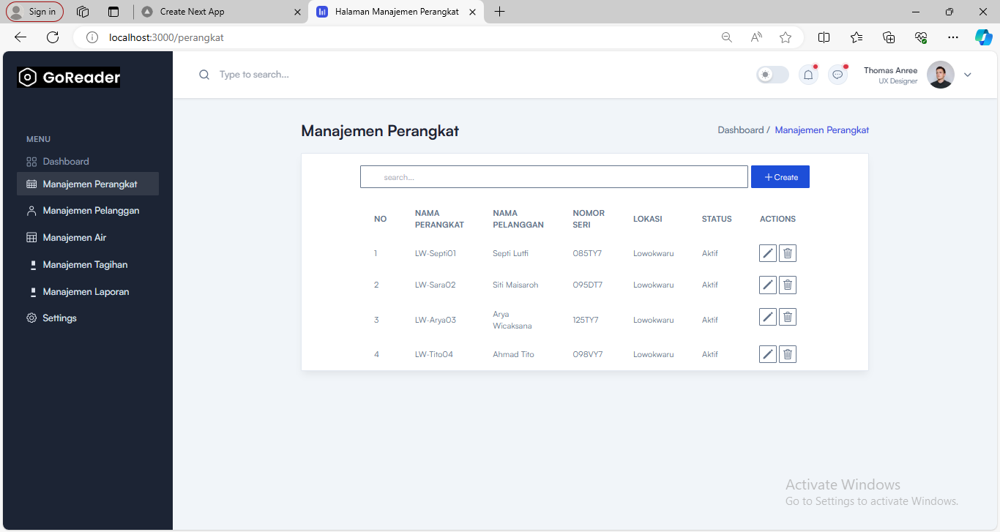
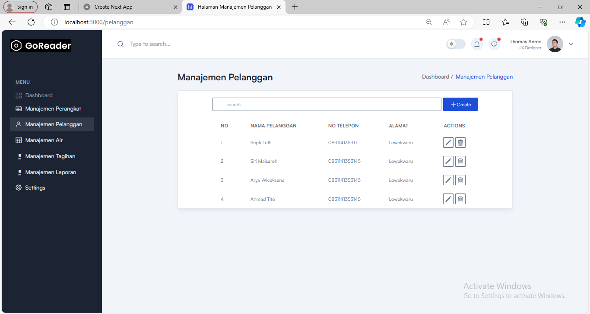
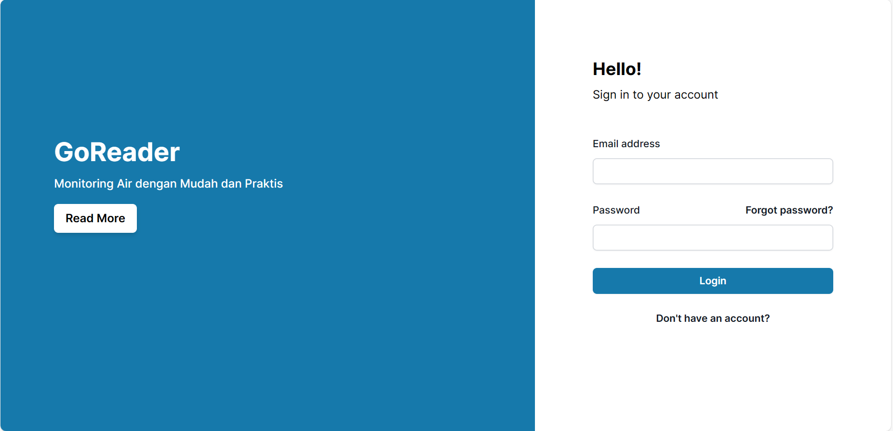
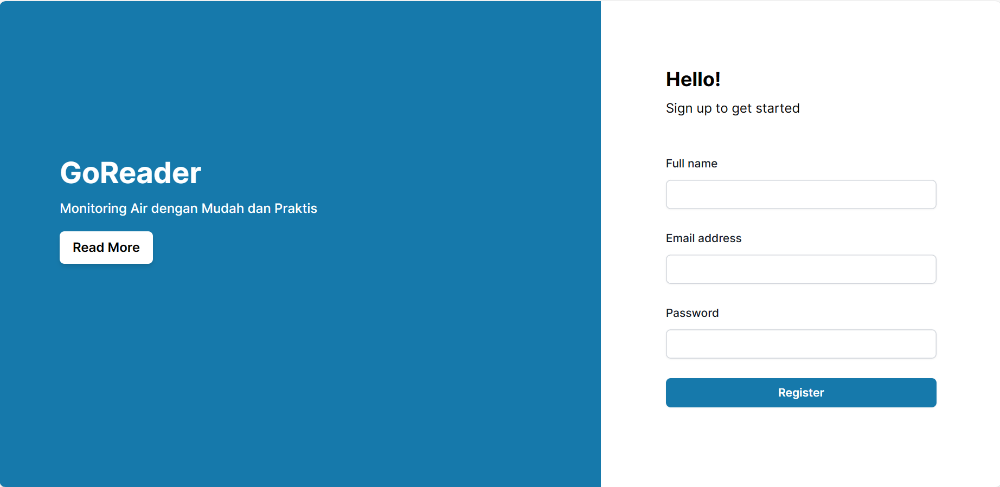
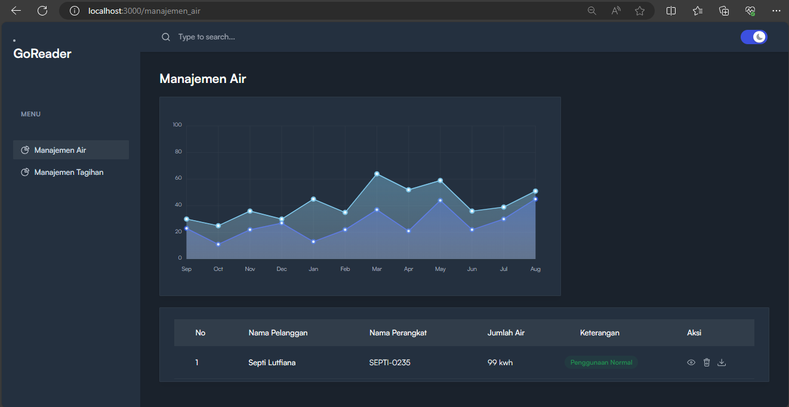
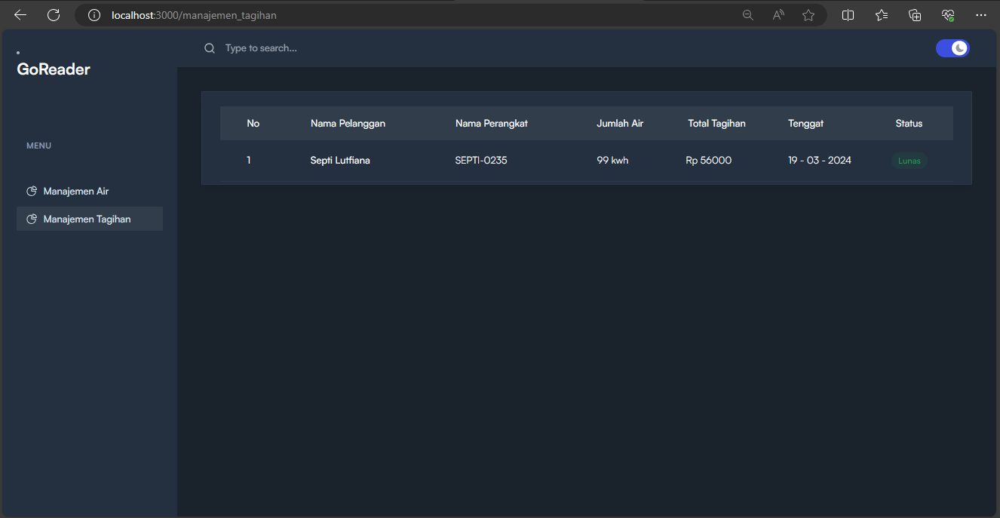

# KELOMPOK 5
## Pembagian Tugas
- Sara : Dashboard, Logout
- Septi : Manajemen perangkat, pelanggan
- Arya : Manajemen air, tagihan
- Tito : Login, Register, Manajemen laporan

## Progres 
### Progres Sara
#### Halaman Dashboard

### Progres Septi 

- Link GitHub

https://github.com/SeptiLutfiana/Proyek_GoReader.git


#### Halaman Manajemen Perangkat



#### Halaman Manajemen Pelanggan



#### Kendala

- button crate saat di klik seharusnya remote ke halaman create, akan tetapi masih not found 404

### Progres Tito

- Link GitHub

https://github.com/Ahmadtito17/GoReader.git


#### Halaman Login



#### Halaman Register



### Progres Arya

- Link GitHub

https://github.com/AryaWicaksanaH/GoReader_ManajemenAir-Tagihan.git


#### Halaman Manajemen Air



#### Halaman Manajemen Tagihan



# Deskripsi Proyek 

https://drive.google.com/drive/folders/1NBdaUMnlMHZflHakF3mQE2AFs862oz6e?usp=sharing

# Link Figma

https://www.figma.com/file/FWmwbaupe5upeLiKWZ0by7/SMART-WATER-METER?type=design&node-id=0%3A1&mode=design&t=15M8WLHNO8BdRdsx-1


# Proses OCR
https://colab.research.google.com/drive/1Vt-xVLz_vz0aMz_XCDEX9aLpjqrXOgP5#scrollTo=PnGyVdEJjhAC

https://colab.research.google.com/drive/1gpQmtJSabZRPbfMcSxQqY8OFiZ5o0X2e?usp=sharing


This is a [Next.js](https://nextjs.org/) project bootstrapped with [`create-next-app`](https://github.com/vercel/next.js/tree/canary/packages/create-next-app).

## Getting Started

First, run the development server:

```bash
npm run dev
# or
yarn dev
# or
pnpm dev
# or
bun dev
```

Open [http://localhost:3000](http://localhost:3000) with your browser to see the result.

You can start editing the page by modifying `app/page.tsx`. The page auto-updates as you edit the file.

This project uses [`next/font`](https://nextjs.org/docs/basic-features/font-optimization) to automatically optimize and load Inter, a custom Google Font.

## Learn More

To learn more about Next.js, take a look at the following resources:

- [Next.js Documentation](https://nextjs.org/docs) - learn about Next.js features and API.
- [Learn Next.js](https://nextjs.org/learn) - an interactive Next.js tutorial.

You can check out [the Next.js GitHub repository](https://github.com/vercel/next.js/) - your feedback and contributions are welcome!

## Deploy on Vercel

The easiest way to deploy your Next.js app is to use the [Vercel Platform](https://vercel.com/new?utm_medium=default-template&filter=next.js&utm_source=create-next-app&utm_campaign=create-next-app-readme) from the creators of Next.js.

Check out our [Next.js deployment documentation](https://nextjs.org/docs/deployment) for more details.
